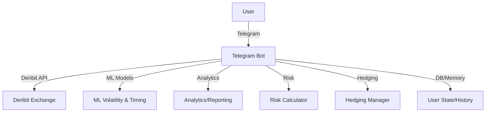

# Crypto Portfolio Risk Management & Automated Hedging Bot

## Executive Summary

This project delivers a robust, production-ready Telegram bot for real-time crypto portfolio risk management and automated hedging. It is designed for professional and advanced retail traders who require continuous risk analytics, automated and manual hedging, and actionable alerts, all powered by live Deribit data and enhanced with machine learning for smarter risk decisions.

## Project Goals
- **Automate risk monitoring and hedging for crypto portfolios**
- **Provide actionable, real-time analytics and alerts via Telegram**
- **Support both manual and automated hedging workflows**
- **Leverage machine learning for volatility forecasting and optimal hedge timing**
- **Ensure extensibility for new exchanges, strategies, and analytics**

---

## Tech Stack

- **Python 3.8+**
- **Telegram Bot API** (python-telegram-bot)
- **Deribit API** (real-time crypto data)
- **Plotly** (interactive charts)
- **scikit-learn** (machine learning)
- **pandas, numpy** (data processing)
- **joblib** (model persistence)
- **loguru** (logging)
- **asyncio** (concurrency)
- **Other libraries:** yfinance, dotenv, etc.

---

## System Architecture & Risk Management Framework

### Architecture Diagram


### Narrative
- **User** interacts with the bot via Telegram commands and buttons.
- **Bot** manages user state, positions, and risk monitoring.
- **Deribit API** provides real-time price and instrument data.
- **Risk Calculator** computes Greeks, VaR, drawdown, and other metrics.
- **Hedging Manager** selects and executes hedging strategies.
- **ML Models** forecast volatility and optimal hedge timing.
- **Analytics** module generates reports, charts, and summaries.

### Risk Management Framework
- Continuous monitoring of all user positions.
- Real-time calculation of risk metrics and breach detection.
- Automated and manual hedging workflows.
- Alert suppression and confirmation logic for safe operation.

---

## Hedging Strategy Implementation & Mathematical Foundations

### Delta-Neutral Hedging
- **Goal:** Offset the portfolio's delta (price sensitivity) to market-neutral.
- **Formula:**
  - Delta (Δ) = ∂P/∂S, where P = portfolio value, S = underlying price
  - Hedge size = -Total Delta / Delta of hedge instrument
- **Implementation:**
  - Calculate total portfolio delta (sum of all positions)
  - Determine required hedge size in perpetuals or options
  - Execute hedge to bring net delta close to zero

### Options-Based Hedging
- **Goal:** Use puts, calls, or collars to reduce downside risk
- **Formulas:**
  - Option Greeks (Delta, Gamma, Theta, Vega) calculated using Black-Scholes or binomial models
  - Hedge size and instrument selection based on risk metrics and cost

### Dynamic Hedging
- **Goal:** Rebalance hedges as market conditions and risk metrics change
- **Implementation:**
  - Monitor risk metrics in real time
  - Trigger rebalancing when thresholds are breached or at scheduled intervals

---

## Real-Time Risk Calculation Algorithms & Methodologies

### Greeks Calculation
- **Delta:** Sensitivity to price changes
- **Gamma:** Sensitivity of delta to price changes
- **Theta:** Time decay
- **Vega:** Sensitivity to volatility
- **Formulas:**
  - Standard Black-Scholes formulas for options
  - For perpetuals/spot: Delta = position size

### Value at Risk (VaR)
- **Historical VaR:**
  - Calculate log returns: r_t = ln(P_t / P_{t-1})
  - VaR at 95%: 5th percentile of negative returns × portfolio value
- **Drawdown:**
  - Max Drawdown = max(Peak - Trough) / Peak

### Correlation & Beta
- **Correlation:** Pearson correlation of asset returns
- **Beta:** Covariance(asset, benchmark) / Variance(benchmark)

### Real-Time Workflow
1. Fetch latest prices for all assets
2. Update position values and P&L
3. Calculate Greeks, VaR, drawdown, correlation
4. Check against user-configured thresholds
5. Trigger alerts or hedges as needed

---

## Telegram Bot Command Structure & Interaction Flow

### Command Structure
- `/start` — Start/help
- `/monitor_risk <asset> <size> <threshold>` — Start monitoring
- `/hedge_now <asset> <size>` — Manual hedge
- `/auto_hedge <strategy> <threshold>` — Enable auto-hedging
- `/hedge_status <asset>` — Status
- `/hedge_history <asset> <timeframe>` — History
- `/risk_report`, `/risk_charts` — Analytics
- `/set_alert <metric> <value>` — Custom alerts
- `/reset_alerts`, `/emergency_stop`, `/status`, `/version`

### Interaction Flow
1. User sends command or presses button
2. Bot parses command, updates state, and responds
3. For risk/hedge actions, bot may prompt for confirmation (if large)
4. Bot sends alerts, charts, or reports as needed
5. All actions are logged and reflected in analytics

---

## Setup & Deployment Instructions

### Prerequisites
- Python 3.8+
- Telegram bot token
- Deribit API credentials

### Installation
1. Clone the repository
2. Install dependencies:
   ```sh
   pip install -r requirements.txt
   ```
3. Configure `.env`:
   ```env
   TELEGRAM_BOT_TOKEN=your_token_here
   DERIBIT_API_KEY=your_key_here
   DERIBIT_SECRET=your_secret_here
   ```
4. Run the bot:
   ```sh
   python run_bot.py
   ```

---

## Risk Management Best Practices & Limitations

### Best Practices
- Regularly review and adjust risk thresholds
- Use multiple risk metrics (delta, VaR, drawdown) for robust monitoring
- Confirm large hedges manually to avoid unintended trades
- Retrain ML models with up-to-date data for best performance
- Monitor bot logs for errors or unusual activity

### Limitations
- ML models are only as good as the data and features provided
- Real-time data/API outages may impact monitoring and hedging
- Options-based hedging assumes liquid markets and accurate Greeks
- Alert suppression may delay notification of new breaches
- No persistent storage of user data by default (can be added)

---

## Risk Management Documentation

### Mathematical Models & Formulas
- **Delta (Δ):** ∂P/∂S
- **Gamma (Γ):** ∂²P/∂S²
- **Theta (Θ):** ∂P/∂t
- **Vega (ν):** ∂P/∂σ
- **VaR (95%):** 5th percentile of negative returns × portfolio value
- **Drawdown:** max(Peak - Trough) / Peak
- **Correlation:** Pearson correlation coefficient
- **Beta:** Cov(asset, benchmark) / Var(benchmark)

### Assumptions & Limitations
- Greeks are calculated using Black-Scholes for options; may not capture all market realities
- VaR assumes historical returns are indicative of future risk
- Hedging assumes sufficient liquidity and no slippage (real execution may differ)
- ML models are not a guarantee of optimal timing; always review model performance

### Performance Analysis & Optimization Recommendations
- Monitor hedge effectiveness by tracking P&L and risk metrics before/after hedges
- Tune risk thresholds and suppression windows based on portfolio volatility
- Retrain ML models regularly and validate with out-of-sample data
- Consider stress testing with simulated market scenarios
- Review logs and analytics for missed or late hedges

---

## Detailed Workflow

1. **User Interaction**: User sends a command (e.g., `/monitor_risk BTC 10 0.05`) via Telegram.
2. **Position Setup**: Bot creates or updates the user's position and starts monitoring.
3. **Price Polling**: Bot fetches real-time prices from Deribit at regular intervals (default: 30s).
4. **Risk Calculation**: For each position, the bot calculates Greeks, VaR, drawdown, and other metrics using the latest prices.
5. **Alerting**: If a risk threshold is breached, the bot sends a formatted alert to the user, including quick action buttons.
6. **Hedging Decision**: If auto-hedging is enabled and ML models approve, the bot prepares a hedge order. Large trades require user confirmation.
7. **Hedge Execution**: Upon confirmation (or if not required), the bot executes the hedge via the Deribit API and logs the action.
8. **Post-Hedge Handling**: Alerts are suppressed for a configurable window, and the bot updates analytics and history.

---

## Machine Learning Integration

### Volatility Forecasting
- **Model**: RandomForestRegressor (scikit-learn)
- **Features**: Rolling mean, momentum, and historical volatility of log returns
- **Training**: Trained on historical price data (default: BTC sample, can be retrained with real data)
- **Usage**: Used in risk and hedge calculations to provide a forward-looking volatility estimate

### Optimal Hedge Timing
- **Model**: RandomForestClassifier (scikit-learn)
- **Features**: Volatility, position size, time since last hedge, delta
- **Labels**: 1 = optimal to hedge, 0 = wait (synthetic or real labels)
- **Usage**: Before executing an auto-hedge, the bot consults this model; if the model says "wait," the hedge is skipped

### Integration Points
- ML models are loaded at bot startup and used in all relevant risk/hedge calculations
- Retrain models with `python ml/train_models.py` and update data as needed

---

## Error Handling & Alert Suppression

- **Error Handling**: All API calls, calculations, and Telegram interactions are wrapped in try/except blocks with detailed logging. User-facing errors are clear and actionable.
- **Alert Suppression**: After a hedge, alerts are suppressed for 1 hour (configurable). The bot tracks `suppress_alerts` and `last_hedge_time` per position. Manual `/reset_alerts` command is available.
- **Confirmation Logic**: Large hedges require explicit user confirmation. The bot tracks pending confirmations and prevents repeated prompts.

---

## Security & Privacy Considerations

- **API Keys**: All sensitive keys are loaded from environment variables and never hardcoded.
- **User Data**: User positions and history are kept in memory only (no persistent storage by default).
- **Telegram Security**: Only the bot owner or authorized users should be allowed to interact with the bot (add user checks as needed).
- **Logging**: Logs are written to `hedging_bot.log` and do not include sensitive information.

---

## Extensibility

- **Adding New Exchanges**: Implement a new connector in `exchanges/` and update the bot to use it.
- **New Hedging Strategies**: Add a new strategy class in `hedging/strategies.py` and register it with the `HedgingManager`.
- **Custom Analytics**: Extend `analytics/reporter.py` for new reports or charts.
- **ML Models**: Add new models in `ml/` and integrate them in the bot logic.

---

## Example User Scenarios

### Scenario 1: Basic Risk Monitoring
1. User sends `/monitor_risk BTC 10 0.05`.
2. Bot starts monitoring 10 BTC with a 5% delta risk threshold.
3. If risk is breached, bot sends an alert with quick action buttons.

### Scenario 2: Auto-Hedging with ML
1. User enables auto-hedging: `/auto_hedge delta_neutral 0.05`.
2. Bot monitors risk and, if breached, consults ML models.
3. If ML approves, bot prepares a hedge order. If large, asks for confirmation.
4. User confirms; bot executes hedge and suppresses further alerts for 1 hour.

### Scenario 3: Custom Alerts and Analytics
1. User sets a custom VaR alert: `/set_alert var_95 10000`.
2. Bot monitors and notifies if VaR exceeds $10,000.
3. User requests a risk report: `/risk_report`.
4. Bot sends a detailed report and offers export as PDF.

---

## Glossary
- **Delta, Gamma, Theta, Vega**: Option Greeks, key risk metrics
- **VaR**: Value at Risk, a measure of potential loss
- **Drawdown**: Maximum observed loss from a peak
- **Auto-Hedge**: Automated execution of a hedge when risk is breached
- **ML**: Machine Learning
- **RandomForestRegressor/Classifier**: Types of ML models used
- **Suppression Window**: Time after a hedge during which alerts are muted

---

## References & Further Reading
- [Deribit API Docs](https://docs.deribit.com/)
- [python-telegram-bot](https://python-telegram-bot.org/)
- [scikit-learn](https://scikit-learn.org/)
- [Plotly](https://plotly.com/python/)
- [Crypto Risk Management](https://www.cmegroup.com/education/courses/introduction-to-options/greeks.html)

---

## File Structure

```
QUANT/
├── bot/
├── ml/
├── hedging/
├── risk/
├── analytics/
├── exchanges/
├── utils/
├── requirements.txt
├── run_bot.py
└── ...
```

---

## FAQ & Tips

- Retrain ML models: edit and run `ml/train_models.py`
- Add new assets: `/monitor_risk <asset> ...`
- Change alert suppression: edit `bot/telegram_bot.py`
- Multi-exchange ready: add connectors in `exchanges/` 